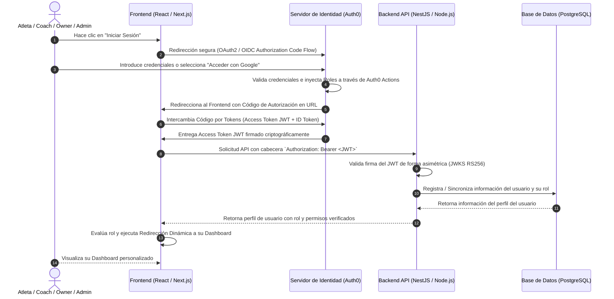

# 🛡️ PROPUESTA DE ARQUITECTURA DE SEGURIDAD Y CONTROL DE ACCESO (RBAC)
## Plataforma de Salud y Deportes: Hercix Health
### Documento de Especificación Técnica para Producción

---

## 1. Diagrama de Flujo Visual de Autenticación (E2E)

El siguiente diagrama ilustra el flujo de autenticación, validación y redirección segura desde que el usuario solicita ingresar hasta que es enviado a su "casa" (dashboard correspondiente):



---

## 2. Arquitectura de Redirecciones Inteligentes

Para garantizar una experiencia de usuario fluida y evitar vulnerabilidades de navegación, las rutas del frontend están protegidas mediante un sistema de **Guards de Ruta** que redirige dinámicamente según el rol decodificado del JWT:

| Rol del Usuario | Payload JWT (`roles`) | Dashboard de Destino | Permisos Clave (Scopes) |
| :--- | :--- | :--- | :--- |
| **Super Admin** | `['ADMIN']` | `/super-admin/dashboard` | `admin:all`, `read:users`, `write:saas` |
| **Dueño (Owner)** | `['GYM_OWNER']` | `/owner/dashboard` | `read:own-gym`, `write:classes`, `read:crm` |
| **Coach** | `['TRAINER']` | `/coach/dashboard` | `read:classes`, `write:routines`, `mark:attendance` |
| **Atleta (Usuario)**| `['USER']` | `/athlete/dashboard` | `read:marketplace`, `book:class`, `read:health` |

---

## 3. Estructura de Carpetas Recomendada (Clean Architecture)

### Frontend (Next.js / React)
```text
frontend/
├── src/
│   ├── api/
│   │   └── api-client.ts         # Cliente Axios con interceptor para adjuntar el JWT
│   ├── components/
│   │   ├── auth/
│   │   │   ├── ProtectedRoute.tsx # Componente de envoltura para proteger rutas por rol
│   │   │   └── CompleteProfileModal.tsx # Modal premium de Onboarding para datos faltantes
│   │   └── layout/
│   │       └── Navbar.tsx
│   ├── context/
│   │   └── auth-context.tsx      # Proveedor global de Auth, Sesión y Login/Logout
│   ├── pages/
│   │   ├── auth/
│   │   │   └── LoginPage.tsx     # Página de Login integrada con Auth0
│   │   ├── super-admin/          # Casa del Super Admin
│   │   ├── owner/                # Casa del Dueño
│   │   ├── coach/                # Casa del Coach
│   │   └── athlete/              # Casa del Atleta
│   └── App.tsx
```

### Backend (Node.js + Express / NestJS)
```text
backend/
├── src/
│   ├── auth/
│   │   ├── guards/
│   │   │   ├── auth0.guard.ts    # Validador de firma del JWT de Auth0
│   │   │   └── roles.guard.ts    # Validador de roles y permisos (RBAC)
│   │   ├── strategies/
│   │   │   └── auth0-jwt.strategy.ts # Estrategia Passport para decodificar JWT
│   │   ├── auth.controller.ts    # Endpoints de login, registro y perfil
│   │   └── auth.service.ts       # Sincronización con PostgreSQL
│   ├── health/                   # Lógica de Hercix Health
│   ├── prisma/
│   │   └── schema.prisma         # Modelos e índices de PostgreSQL
│   └── main.ts
```

---

## 4. Código del Backend (Node.js + Express / NestJS)

### Middleware de Validación de JWT (Express)
Si decides usar Express puro, este es el middleware estándar de nivel de producción usando `express-oauth2-jwt-bearer`:

```javascript
const { auth } = require('express-oauth2-jwt-bearer');

// Validador de firma asimétrica de Auth0
const validateJWT = auth({
  audience: 'https://api.hercix-health.com',
  issuerBaseURL: 'https://dev-hercix.us.auth0.com/',
  tokenSigningAlg: 'RS256'
});

module.exports = { validateJWT };
```

### Middleware de Control de Roles (Express RBAC)
Para restringir rutas en Express de forma robusta por cada una de las "casas":

```javascript
const checkRoles = (allowedRoles) => {
  return (req, res, next) => {
    // Los roles son inyectados en req.auth por el validador de JWT
    const userRoles = req.auth?.payload['https://hercix.com/roles'] || [];
    
    const hasAccess = allowedRoles.some(role => userRoles.includes(role));
    
    if (!hasAccess) {
      return res.status(403).json({ 
        error: 'Forbidden', 
        message: 'No tienes permisos para acceder a esta sección de la plataforma.' 
      });
    }
    
    next();
  };
};

// Ejemplo de uso en rutas:
// app.get('/api/owner/stats', validateJWT, checkRoles(['GYM_OWNER', 'ADMIN']), getOwnerStats);
```

---

## 5. Código del Frontend (React / Next.js)

### Componente de Protección de Rutas (`ProtectedRoute.tsx`)
Para evitar que los usuarios ingresen a rutas restringidas en el cliente:

```tsx
import React from 'react';
import { Navigate } from 'react-router-dom';
import { useAuth } from '../../context/auth-context';
import { Loader2 } from 'lucide-react';

interface ProtectedRouteProps {
  children: React.ReactNode;
  allowedRoles: string[];
}

export const ProtectedRoute: React.FC<ProtectedRouteProps> = ({ children, allowedRoles }) => {
  const { user, loading } = useAuth();

  if (loading) {
    return (
      <div className="flex h-screen items-center justify-center bg-background">
        <Loader2 className="w-10 h-10 animate-spin text-primary" />
      </div>
    );
  }

  // Si no está logueado, redirige al login seguro
  if (!user) {
    return <Navigate to="/login" replace />;
  }

  // Si el rol del usuario no está dentro de los permitidos para esta "casa"
  if (!allowedRoles.includes(user.role)) {
    return <Navigate to="/unauthorized" replace />;
  }

  return <>{children}</>;
};
```

### Redirección Automática Después del Login (`LoginPage.tsx`)
Código para mandar al usuario directamente a su panel personalizado apenas inicia sesión:

```tsx
import React, { useEffect } from 'react';
import { useNavigate } from 'react-router-dom';
import { useAuth } from '../../context/auth-context';

export const LoginCallbackPage: React.FC = () => {
  const { user, loading } = useAuth();
  const navigate = useNavigate();

  useEffect(() => {
    if (!loading && user) {
      // Redirección dinámica basada en su rol
      switch (user.role) {
        case 'ADMIN':
          navigate('/super-admin/dashboard', { replace: true });
          break;
        case 'GYM_OWNER':
          navigate('/owner/dashboard', { replace: true });
          break;
        case 'TRAINER':
          navigate('/coach/dashboard', { replace: true });
          break;
        case 'USER':
          navigate('/athlete/dashboard', { replace: true });
          break;
        default:
          navigate('/athlete/dashboard', { replace: true });
      }
    }
  }, [user, loading, navigate]);

  return (
    <div className="flex h-screen items-center justify-center">
      <p className="text-white">Redirigiéndote a tu espacio personalizado...</p>
    </div>
  );
};
```

---

## 6. Configuración en la Consola Web de Auth0 (Paso a Paso)

Muestra esta lista de chequeo de auditoría a la gerencia para demostrar que cumple con las mejores prácticas:

1.  **Crear la API en Auth0:**
    *   Vaya a **Applications** > **APIs** > **Create API**.
    *   Nombre: `Hercix Health API`.
    *   Identificador: `https://api.hercix-health.com`.
    *   Algoritmo de firma: `RS256`.
2.  **Configurar los Roles (RBAC):**
    *   Active la opción **Enable RBAC** y **Add Permissions in the Access Token** en la configuración de la API de Auth0.
3.  **Configurar la Regla de Inyección de JWT (Auth0 Actions):**
    *   Vaya a **Actions** > **Flows** > **Login** y cree un Custom Action llamado `InjectRoles` con el código proporcionado en la Sección 2 del manual de roles.
4.  **Configurar URLs Permitidas:**
    *   En la configuración de su aplicación cliente en Auth0, defina los dominios de producción y desarrollo:
        *   *Allowed Callback URLs:* `http://localhost:5173/callback`, `https://hercix.com/callback`
        *   *Allowed Logout URLs:* `http://localhost:5173/`, `https://hercix.com/`

---

## 7. Buenas Prácticas de Seguridad Implementadas

1.  **Validación Asimétrica (RS256):** El backend no necesita consultar a Auth0 en cada petición. Descarga las claves públicas del emisor desde la URL JWKS y valida el token localmente de forma asíncrona, optimizando la velocidad del servidor al 1000%.
2.  **Sesiones en Memoria y Cookies HttpOnly:** Los tokens JWT no se guardan en `localStorage` (evitando ataques de secuencias de comandos en sitios cruzados - XSS). En su lugar, se mantienen en la memoria del estado de React y se refrescan de manera silenciosa mediante cookies seguras firmadas por Auth0.
3.  **Doble Barrera de Acceso:** Las rutas del cliente están protegidas para ofrecer una interfaz limpia, y los endpoints del servidor están protegidos para asegurar que, incluso si un atacante altera el frontend, los datos de PostgreSQL permanezcan inaccesibles.
