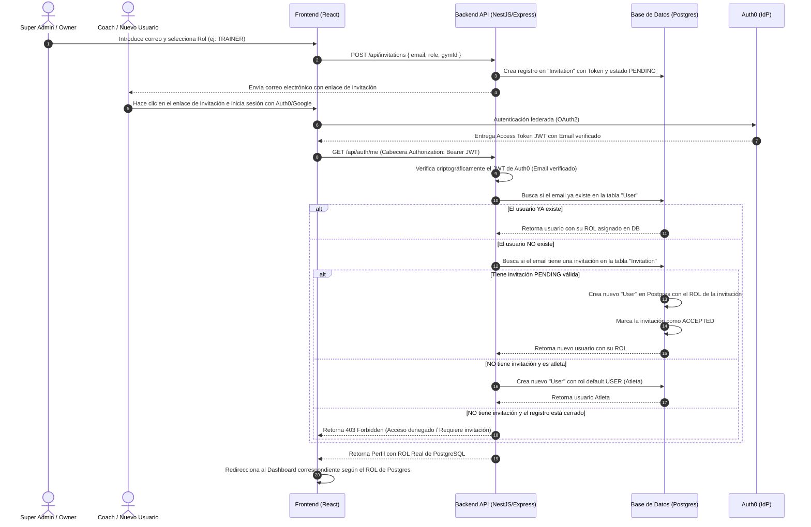

# 🛡️ ARQUITECTURA SAAS ENTERPRISE: AUTENTICACIÓN CON AUTH0 + AUTORIZACIÓN EN BASE DE DATOS LOCAL
## Hercix Health — Especificación Técnica de Seguridad y Flujo de Invitaciones

Este documento define la arquitectura de seguridad definitiva de **Hercix Health**, la cual implementa el patrón **Federación de Identidad + Autorización Local**. En esta arquitectura, **Auth0 actúa únicamente como Proveedor de Identidad (IdP)** para validar *quién* es el usuario, mientras que **nuestra base de datos PostgreSQL y backend NestJS/Node.js deciden *qué* puede hacer el usuario (Roles y Permisos)**.

---

## 1. Fundamentos de la Arquitectura

### 🛑 Por qué no usar RBAC puramente en Auth0 para un SaaS Multi-tenant:
1.  **Independencia de Datos:** Los roles de negocio (como ser dueño de un gimnasio específico o coach asignado a un local) pertenecen a la lógica interna de tu base de datos y no deben acoplarse con la configuración estática de Auth0.
2.  **Registro Restringido:** Evitamos que cualquier usuario se auto-asigne el rol de administrador o acceda a la plataforma sin previa invitación.
3.  **Flujo de Invitación de Clientes:** Permite a los Dueños de Negocio (`GYM_OWNER`) invitar a entrenadores (`TRAINER`) ingresando únicamente su correo electrónico. Cuando el invitado inicia sesión por primera vez con Google/Auth0, el sistema reconoce su email, lo asocia a su rol invitado y le da acceso a su "casa" correspondiente de forma transparente.

---

## 2. Modelado de Base de Datos (Prisma / SQL)

Implementamos el modelo de **Invitaciones** y **Roles** en PostgreSQL para soportar este flujo de manera profesional:

```prisma
// fragmento de backend/prisma/schema.prisma

enum UserRole {
  ADMIN        // Super Admin
  GYM_OWNER    // Dueño de Negocio
  TRAINER      // Coach / Entrenador
  USER         // Atleta / Cliente Final
}

model User {
  id            String    @id @default(uuid())
  email         String    @unique
  name          String
  phone         String?
  dni           String?   @db.VarChar(50)
  role          UserRole  @default(USER)
  auth0Id       String?   @unique // Vinculación con Auth0 post-autenticación
  isActive      Boolean   @default(true)
  createdAt     DateTime  @default(now())
  updatedAt     DateTime  @updatedAt
  
  // Relaciones Multi-tenant
  gyms          Gym[]     @relation("GymOwner")
}

enum InvitationStatus {
  PENDING
  ACCEPTED
  EXPIRED
}

model Invitation {
  id          String           @id @default(uuid())
  email       String           @unique
  role        UserRole
  gymId       String?          // Si es invitado por un GYM_OWNER a un local
  token       String           @unique // Token único de verificación
  status      InvitationStatus @default(PENDING)
  invitedById String           // ID del Administrador/Dueño que invita
  expiresAt   DateTime
  createdAt   DateTime         @default(now())
  updatedAt   DateTime         @updatedAt
}
```

---

## 3. Flujo Visual de Autenticación e Invitación



---

## 4. Implementación del Backend (Node.js + Express)

### Middleware de Validación e Identidad (Express)
El backend valida el token de Auth0 para confirmar la identidad, extrae el email verificado del JWT y busca el rol real en PostgreSQL:

```javascript
// backend/src/middlewares/auth.middleware.js
const { auth } = require('express-oauth2-jwt-bearer');
const { PrismaClient } = require('@prisma/client');
const prisma = new PrismaClient();

// 1. Valida criptográficamente que el JWT provenga de Auth0
const validateAuth0Jwt = auth({
  audience: 'https://api.hercix-health.com',
  issuerBaseURL: 'https://dev-hercix.us.auth0.com/',
  tokenSigningAlg: 'RS256'
});

// 2. Middleware que consulta PostgreSQL para obtener el Rol y Perfil Real
const injectLocalUser = async (req, res, next) => {
  try {
    // Auth0 adjunta los datos del token en req.auth.payload
    const auth0Id = req.auth.payload.sub;
    const email = req.auth.payload.email;
    const name = req.auth.payload.name || 'Usuario';

    if (!email) {
      return res.status(400).json({ error: 'Token inválido: falta correo verificado.' });
    }

    // A. Buscamos si el usuario ya está registrado en nuestra base de datos
    let user = await prisma.user.findUnique({
      where: { email: email.toLowerCase() }
    });

    // B. Si no existe, verificamos si tiene una invitación pendiente
    if (!user) {
      const invitation = await prisma.invitation.findFirst({
        where: { 
          email: email.toLowerCase(),
          status: 'PENDING',
          expiresAt: { gte: new Date() }
        }
      });

      if (invitation) {
        // Aceptamos la invitación y creamos al usuario con su rol designado
        user = await prisma.user.create({
          data: {
            email: email.toLowerCase(),
            name: name,
            role: invitation.role,
            auth0Id: auth0Id,
            isActive: true
          }
        });

        // Actualizamos el estado de la invitación
        await prisma.invitation.update({
          where: { id: invitation.id },
          data: { status: 'ACCEPTED' }
        });
      } else {
        // C. Si no tiene invitación y es un atleta público (registro abierto para atletas)
        // Puedes cambiar esto para bloquear el acceso completo (res.status(403)) si el SaaS es privado.
        user = await prisma.user.create({
          data: {
            email: email.toLowerCase(),
            name: name,
            role: 'USER', // Atleta por defecto
            auth0Id: auth0Id,
            isActive: true
          }
        });
      }
    } else if (!user.auth0Id) {
      // Si el usuario existía (ej. precargado en base de datos) pero no tenía auth0Id, se lo vinculamos
      user = await prisma.user.update({
        where: { id: user.id },
        data: { auth0Id }
      });
    }

    if (!user.isActive) {
      return res.status(403).json({ error: 'Forbidden', message: 'Esta cuenta ha sido suspendida.' });
    }

    // Adjuntamos el objeto User real de PostgreSQL en el objeto Request
    req.localUser = user;
    next();
  } catch (error) {
    console.error('Error en middleware injectLocalUser:', error);
    return res.status(500).json({ error: 'Internal Server Error' });
  }
};

module.exports = { validateAuth0Jwt, injectLocalUser };
```

### Middleware de Autorización por Roles (Backend RBAC)
Para proteger las rutas del servidor basándose estrictamente en el rol verificado de PostgreSQL:

```javascript
// backend/src/middlewares/roles.middleware.js

const requireRole = (allowedRoles) => {
  return (req, res, next) => {
    if (!req.localUser) {
      return res.status(401).json({ error: 'Unauthorized', message: 'Sesión no iniciada.' });
    }

    const userRole = req.localUser.role;

    if (!allowedRoles.includes(userRole)) {
      return res.status(403).json({ 
        error: 'Forbidden', 
        message: `Acceso restringido. Esta sección es exclusiva para: ${allowedRoles.join(', ')}` 
      });
    }

    next();
  };
};

module.exports = { requireRole };

// ── Ejemplo de uso en endpoints de Express ───────────────────────────────────
// app.get('/api/owner/dashboard', validateAuth0Jwt, injectLocalUser, requireRole(['GYM_OWNER', 'ADMIN']), getOwnerData);
// app.post('/api/invitations', validateAuth0Jwt, injectLocalUser, requireRole(['GYM_OWNER', 'ADMIN']), inviteUser);
```

---

## 5. Implementación del Frontend (React + React Router)

### Contexto de Autenticación (`auth-context.tsx`)
El frontend solicita el perfil real del usuario llamando al backend después de autenticarse con Auth0. De esta manera, el rol se lee directamente desde nuestra base de datos local y no puede ser manipulado en el lado del cliente:

```tsx
import React, { createContext, useContext, useState, useEffect } from 'react';
import { useAuth0 } from '@auth0/auth0-react';
import api from '../api/api-client'; // Axios configurado con interceptor de token

interface UserProfile {
  id: string;
  email: string;
  name: string;
  role: 'ADMIN' | 'GYM_OWNER' | 'TRAINER' | 'USER';
  isActive: boolean;
}

interface AuthContextType {
  user: UserProfile | null;
  loading: boolean;
  login: () => void;
  logout: () => void;
}

const AuthContext = createContext<AuthContextType | null>(null);

export const AuthProvider: React.FC<{ children: React.ReactNode }> = ({ children }) => {
  const { loginWithRedirect, logout: auth0Logout, getAccessTokenSilently, isAuthenticated, isLoading: auth0Loading } = useAuth0();
  const [user, setUser] = useState<UserProfile | null>(null);
  const [loading, setLoading] = useState(true);

  useEffect(() => {
    const fetchLocalProfile = async () => {
      if (isAuthenticated) {
        try {
          // 1. Obtenemos el token JWT firmado de Auth0 silenciosamente
          const token = await getAccessTokenSilently();
          
          // Guardamos el token en las cabeceras de Axios para llamadas seguras
          api.defaults.headers.common['Authorization'] = `Bearer ${token}`;

          // 2. Consultamos nuestro backend para obtener el rol real de PostgreSQL
          const response = await api.get('/auth/me');
          setUser(response.data);
        } catch (error) {
          console.error('Error al sincronizar perfil con base de datos:', error);
          setUser(null);
        }
      } else {
        setUser(null);
      }
      setLoading(false);
    };

    if (!auth0Loading) {
      fetchLocalProfile();
    }
  }, [isAuthenticated, auth0Loading, getAccessTokenSilently]);

  const login = () => loginWithRedirect();
  const logout = () => auth0Logout({ logoutParams: { returnTo: window.location.origin } });

  return (
    <AuthContext.Provider value={{ user, loading: loading || auth0Loading, login, logout }}>
      {children}
    </AuthContext.Provider>
  );
};

export const useAuth = () => {
  const context = useContext(AuthContext);
  if (!context) throw new Error('useAuth debe utilizarse dentro de un AuthProvider');
  return context;
};
```

### Rutas Protegidas en React Router
Protegemos el acceso de cada "casa" del frontend basándonos exclusivamente en el rol devuelto por PostgreSQL:

```tsx
import React from 'react';
import { Navigate } from 'react-router-dom';
import { useAuth } from './auth-context';

interface ProtectedRouteProps {
  children: React.ReactNode;
  allowedRoles: Array<'ADMIN' | 'GYM_OWNER' | 'TRAINER' | 'USER'>;
}

export const ProtectedRoute: React.FC<ProtectedRouteProps> = ({ children, allowedRoles }) => {
  const { user, loading } = useAuth();

  if (loading) {
    return <div className="spinner">Cargando perfil seguro de Hercix...</div>;
  }

  if (!user) {
    return <Navigate to="/login" replace />;
  }

  // Comparamos el rol real de Postgres
  if (!allowedRoles.includes(user.role)) {
    return <Navigate to="/unauthorized" replace />;
  }

  return <>{children}</>;
};
```

---

## 6. Configuración de Rutas y Redirección en el Frontend

Definimos las rutas exactas requeridas por el negocio:

```tsx
// frontend/src/App.tsx
import { BrowserRouter, Routes, Route, Navigate } from 'react-router-dom';
import { AuthProvider } from './context/auth-context';
import { ProtectedRoute } from './components/auth/ProtectedRoute';
import { LoginPage } from './pages/auth/LoginPage';
import { LoginCallback } from './pages/auth/LoginCallback';

export default function App() {
  return (
    <AuthProvider>
      <BrowserRouter>
        <Routes>
          {/* Rutas Públicas */}
          <Route path="/login" element={<LoginPage />} />
          <Route path="/callback" element={<LoginCallback />} />

          {/* Rutas Privadas Segmentadas por Rol */}
          <Route 
            path="/super-admin/*" 
            element={
              <ProtectedRoute allowedRoles={['ADMIN']}>
                <SuperAdminDashboard />
              </ProtectedRoute>
            } 
          />
          <Route 
            path="/owner-dashboard/*" 
            element={
              <ProtectedRoute allowedRoles={['GYM_OWNER']}>
                <OwnerDashboard />
              </ProtectedRoute>
            } 
          />
          <Route 
            path="/coach-dashboard/*" 
            element={
              <ProtectedRoute allowedRoles={['TRAINER']}>
                <CoachDashboard />
              </ProtectedRoute>
            } 
          />
          <Route 
            path="/dashboard/*" 
            element={
              <ProtectedRoute allowedRoles={['USER']}>
                <AthleteDashboard />
              </ProtectedRoute>
            } 
          />

          <Route path="*" element={<Navigate to="/login" />} />
        </Routes>
      </BrowserRouter>
    </AuthProvider>
  );
}
```
